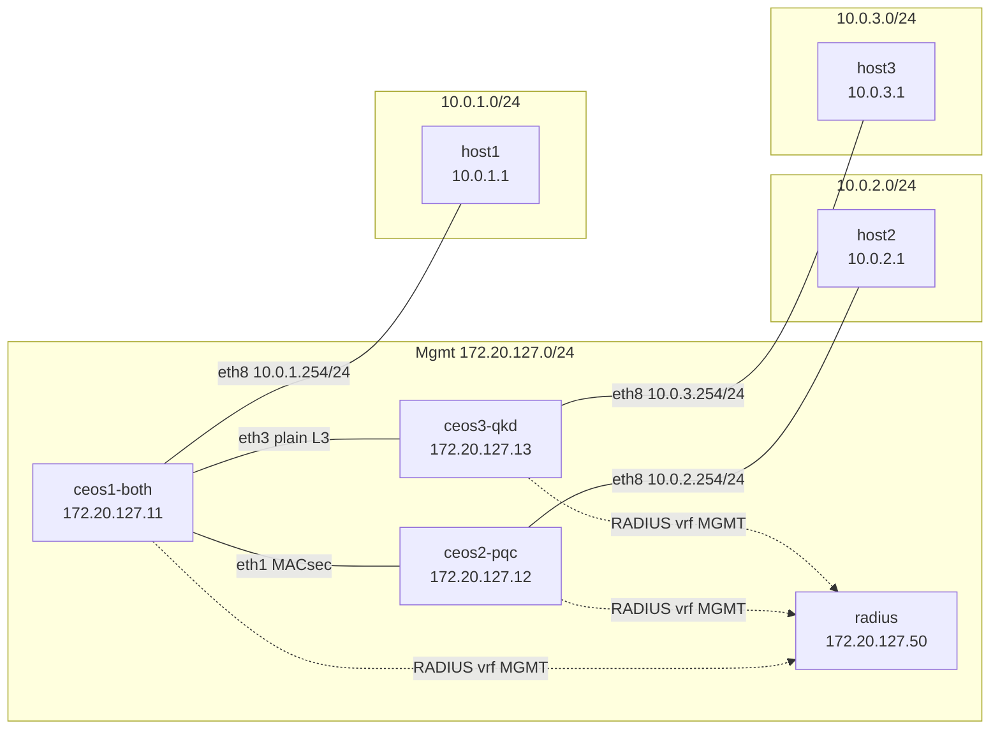

# Quantum Safe Lab

Containerlab lab demonstrating **quantum-safe** network security on Arista cEOS: PQC-hybrid management-plane TLS (RadSec, eAPI, gNMI, syslog, SSH), **dynamic MACsec** on an inter-switch link, and optional ETSI QKD 014 KME simulators on the mgmt network.

Three cEOS switches (`ceos1-both`, `ceos2-pqc`, `ceos3-qkd`) form a small routed topology. `ceos1-both` and `ceos2-pqc` connect over an L3 link protected by 802.1X EAP-TLS and MKA-derived keys. `ceos3-qkd` attaches to `ceos1-both` over plain L3 (MACsec not configured yet). Each switch serves an Alpine Linux host on **Ethernet8**. FreeRADIUS runs on the management network (`172.20.127.0/24`). cEOS nodes use the **MGMT VRF** for management and RadSec traffic; hosts reach each other via static routes on the switches.

Lab identity in Containerlab: `name: quantum-safe`, `prefix: arista` → containers `arista-quantum-safe-<node>`.

## Overview

Nine data-plane nodes plus syslog collector and two KME simulators on the mgmt network:

| Node | Role |
|------|------|
| ceos1-both, ceos2-pqc, ceos3-qkd | Arista cEOS switches — MGMT VRF, RadSec client, remote syslog (TLS); **ceos1-both/ceos2-pqc MACsec on eth1**; ceos3-qkd plain L3 to ceos1-both |
| host1, host2, host3 | Alpine 3.20 hosts on routed data segments only (no mgmt network) |
| radius | FreeRADIUS server (RadSec + EAP-TLS for dot1x) on the mgmt network |
| syslog | syslog-ng collector (TLS 6514, OpenSSL 3.5 PQC-hybrid) — see [docs/syslog.md](docs/syslog.md) |
| kme-a | [next-door-key-simulator](https://github.com/CreepPork/next-door-key-simulator) KME (HTTPS 8010, lab SAE client + peer) — see [docs/kme.md](docs/kme.md) |
| kme-b | Peer KME (HTTPS 8020, linked to `kme-a` via `OTHER_KMES`) — see [docs/kme.md](docs/kme.md) |

## Prerequisites

| Requirement | Notes |
|-------------|-------|
| Devcontainer rebuild | DinD devcontainer (trixie fork of `devcontainer-dind-slim`, CLAB **0.78.0**) — see [docs/devcontainer.md](docs/devcontainer.md) |
| RAM | ~10 GB minimum (three cEOS containers are memory-heavy) |
| Containerlab CLI | Installed at devcontainer build time (`CLAB_VERSION` in Makefile); verify with `containerlab version` |
| Docker (dind) | Inner daemon must match host arch (amd64 or aarch64) |
| cEOS image | **Required for deploy** — import manually or via optional `make download-ceos` |
| Mgmt subnet | Default `172.20.127.0/24`; override with `MGMT_SUBNET=…` if host NIC overlaps (see [docs/makefile.md](docs/makefile.md)) |
| Arista portal token | **Optional** — only for `make download-ceos` ([create token](https://www.arista.com/en/users/profile)) |

Rebuild the devcontainer after pulling changes (Command Palette → *Dev Containers: Rebuild Container*).

## cEOS import (multi-arch)

You need a local Docker image tagged `ceos:4.36.1F` matching your host architecture before `make deploy`.

### Optional (recommended): auto-download

Requires an [Arista portal token](https://www.arista.com/en/users/profile) with an active maintenance contract:

```bash
cp .env.example .env          # add ARISTA_TOKEN
make download-ceos-help
make download-ceos            # reads .env automatically; picks cEOS64 or cEOSarm
make check-ceos-image
```

`make download-ceos` uses [`eos-downloader`](https://pypi.org/project/eos-downloader/) (`ardl`). Downloaded `.tar.xz` files and `.sha512sum` checksums land in `download/` (gitignored).

### Manual import (no token)

```bash
make import-ceos-help
```

**amd64:**

```bash
docker import download/cEOS64-lab-4.36.1F.tar.xz ceos:4.36.1F
```

**aarch64:**

```bash
docker import download/cEOSarm-lab-4.36.1F.tar.xz ceos:4.36.1F
```

On arm64, Arista may ship an EFT suffix in the filename (e.g. `download/cEOSarm-lab-4.36.1F-EFT1.tar.xz`). Use the downloaded filename but tag as `ceos:4.36.1F`.

Verify:

```bash
make check-ceos-image
```

Expected failure before import:

```
cEOS image 'ceos:4.36.1F' not found locally.
# Manual import (no API token required):
...
make download-ceos
```

## FreeRADIUS multi-arch

The `quantum-safe-radius:latest` image is built by `make build-radius` (~2 min first build):

- **amd64 and arm64** — FreeRADIUS **3.2.6** + OpenSSL **3.5.7** (PQC-hybrid groups including `X25519MLKEM768`)
- Post-build verification: `make test-radius-image`

Lab policy (`DEFAULT Auth-Type := Accept`) is baked into the image. Config bind mounts overlay `clients.conf` and a log snippet at runtime — see [docs/radius.md](docs/radius.md).

## Quick start

### Live lab (cEOS imported)

```bash
make deploy
make inspect
make test-radius
make test-pqc
make test-syslog
make test-macsec
make test-hosts
make destroy
```

### Offline validation (no cEOS)

```bash
make gen-topo && make validate-topo && make build-radius && make test
make check-ceos-image    # expected FAIL until cEOS imported
```

See [docs/makefile.md](docs/makefile.md) for all Makefile targets and [docs/verification.md](docs/verification.md) for the full checklist.

## Topology

### Management plane (`172.20.127.0/24`)

| Node | Mgmt IP | Role |
|------|---------|------|
| ceos1-both | 172.20.127.11 | cEOS switch A (hub) |
| ceos2-pqc | 172.20.127.12 | cEOS switch B |
| ceos3-qkd | 172.20.127.13 | cEOS switch C |
| radius | 172.20.127.50 | FreeRADIUS (UDP 1812/1813, RadSec 2083) |
| syslog | 172.20.127.53 | syslog-ng collector (TLS 6514) |

### Data plane (L3 routed segments)



| Link | Addresses |
|------|-----------|
| ceos1-both:eth1 ↔ ceos2-pqc:eth1 | `10.255.0.1/30` ↔ `10.255.0.2/30` |
| ceos1-both:eth3 ↔ ceos3-qkd:eth1 | `10.255.0.5/30` ↔ `10.255.0.6/30` |
| ceos1-both:eth8 ↔ host1:eth1 | `10.0.1.254/24` ↔ `10.0.1.1/24` |
| ceos2-pqc:eth8 ↔ host2:eth1 | `10.0.2.254/24` ↔ `10.0.2.1/24` |
| ceos3-qkd:eth8 ↔ host3:eth1 | `10.0.3.254/24` ↔ `10.0.3.1/24` |
| ceos1-both static routes | `10.0.2.0/24 → 10.255.0.2`, `10.0.3.0/24 → 10.255.0.6` |
| ceos2-pqc static routes | `10.0.1.0/24 → 10.255.0.1`, `10.0.3.0/24 → 10.255.0.1` |
| ceos3-qkd static routes | `10.0.1.0/24 → 10.255.0.5`, `10.0.2.0/24 → 10.255.0.5` |

Full contract: [docs/topology.md](docs/topology.md).

## Verification

| # | Check | Command |
|---|-------|---------|
| 1 | All nodes up | `make inspect` → 10× running |
| 2 | ceos1-both → radius | ping in MGMT VRF |
| 3 | ceos2-pqc → radius | ping in MGMT VRF |
| 3b | ceos3-qkd → radius | ping in MGMT VRF |
| 4 | FreeRADIUS listening | `docker logs arista-quantum-safe-radius` |
| 5 | RADIUS auth | `make test-radius` |
| 6 | TLS 1.3 PQC (eAPI, gNMI, RESTCONF, RadSec, SSH; eos-sdk-rpc see below) | `make test-pqc` |
| 6b | Syslog over TLS (all switches → syslog-ng) | `make test-syslog` |
| 7 | Dynamic MACsec (802.1X + MKA) | `make test-macsec` |
| 8 | Host routing | `make test-hosts` |

Details and troubleshooting: [docs/verification.md](docs/verification.md).

### Known limitation: eos-sdk-rpc

`management api eos-sdk-rpc` (gRPC port **9543**, mTLS, ssl profile `GNMI`) is enabled on all switches and the profile lists hybrid KEX `X25519MLKEM768`. On cEOS **4.36.1F**, live handshakes still negotiate classical **`secp256r1`** — unlike gNMI on the same profile, which negotiates PQC. Session keys for SDK RPC are therefore **not** harvest-now-decrypt-later resistant on this release. `make test-pqc` reports `eos-sdk-rpc gRPC mTLS handshake (TLS 1.3, classical fallback)`. Details: [docs/eos-pqc.md](docs/eos-pqc.md).

## Multi-arch notes

| Component | amd64 | arm64 (aarch64) |
|-----------|-------|-----------------|
| cEOS tarball | `download/cEOS64-lab-4.36.1F.tar.xz` | `download/cEOSarm-lab-4.36.1F.tar.xz` (EFT suffix OK) |
| cEOS Docker tag | `ceos:4.36.1F` | `ceos:4.36.1F` |
| FreeRADIUS | 3.2.6 + OpenSSL 3.5.7 (PQC groups) | Same |
| Devcontainer dind | Local build from `.devcontainer/Dockerfile` (trixie + DinD feature, CLAB **0.78.0**) | Docker CE (latest) |

`make check-ceos-image` fails with a clear message if the imported cEOS architecture does not match the host.

## Troubleshooting

| Issue | Action |
|-------|--------|
| Missing cEOS image | `make import-ceos-help` or `make download-ceos` |
| Wrong cEOS arch | Re-import correct tarball; see `make check-ceos-image` output |
| `ARISTA_TOKEN` / ardl errors | Verify token; fall back to manual import |
| No mgmt connectivity | Confirm gateway `<subnet>.1` in rendered `lab/.gen/ceos*.cfg` — see [docs/verification.md](docs/verification.md#mgmt-gateway) |
| RADIUS issues | Check `lab/logs/radius/radius.log` and container logs |
| Syslog issues | Check `lab/logs/syslog/eos.log` (created on first message), `make test-syslog`, [docs/syslog.md](docs/syslog.md) |
| Host ping fails | Verify L3 addresses and static routes in [docs/topology.md](docs/topology.md) |
| Reset lab host to clean slate | `make clean` — see [docs/verification.md](docs/verification.md#full-reset) |

## Configuration

| Component | Location | Notes |
|-----------|----------|-------|
| cEOS switches | [`configs/ceos/`](configs/ceos/) | MGMT VRF, L3 routing, RADIUS client — [docs/ceos.md](docs/ceos.md) |
| FreeRADIUS | [`configs/radius/raddb/`](configs/radius/raddb/), [`docker/radius/Dockerfile`](docker/radius/Dockerfile) | Multi-arch image — [docs/radius.md](docs/radius.md) |
| Contract tests | [`lab/topology_contract.py`](lab/topology_contract.py) | Validates mgmt + data plane across topo and configs |

## Development

```bash
make test                              # offline pytest
make gen-topo && make validate-topo    # topology contract
make build-radius                      # RADIUS image
pytest -m containerlab                 # optional Containerlab dry-run (rebuilt devcontainer)
```

Documentation index: [docs/README.md](docs/README.md).
