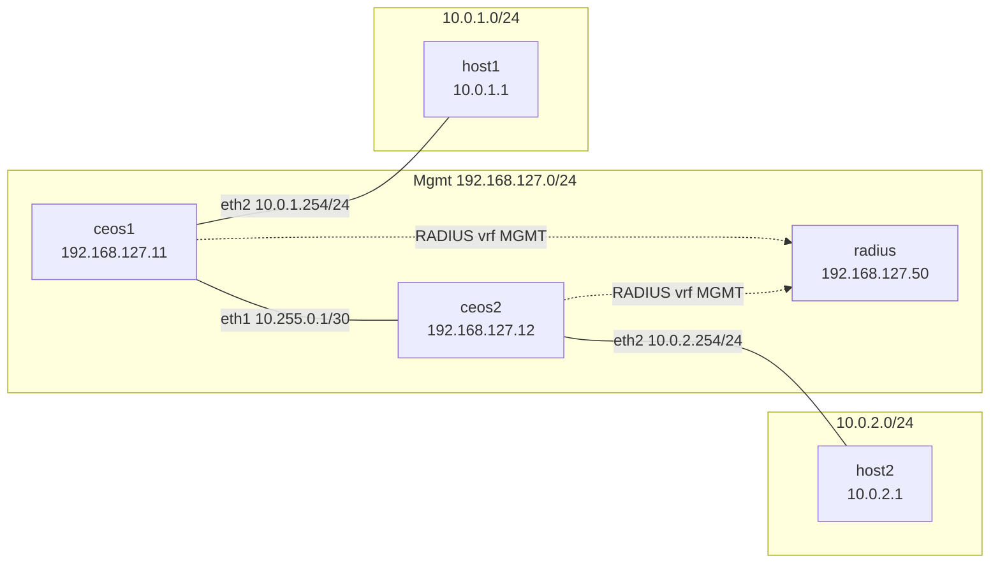

# QKD-MACsec-RADIUS Lab

Containerlab topology for a cEOS + FreeRADIUS management-plane lab (Scope B: no MACsec).

Two Arista cEOS switches (`ceos1`, `ceos2`) connect over an L3 inter-switch link. Each switch serves an Alpine Linux host on a separate routed subnet. FreeRADIUS runs on the management network (`192.168.127.0/24`). cEOS nodes use the **MGMT VRF** for management and RADIUS traffic; hosts reach each other via static routes on the switches.

## Overview

Five Containerlab nodes exercise management-plane RADIUS authentication and L3 host routing:

| Node | Role |
|------|------|
| ceos1, ceos2 | Arista cEOS switches with MGMT VRF and RADIUS client |
| host1, host2 | Alpine 3.20 hosts on routed data segments |
| radius | FreeRADIUS server on the mgmt network |

No MACsec or QKD configuration is included (Scope B).

## Prerequisites

| Requirement | Notes |
|-------------|-------|
| Devcontainer rebuild | Session 4 installs Containerlab, docker-in-docker, and dev Python deps — see [docs/devcontainer.md](docs/devcontainer.md) |
| RAM | ~8 GB minimum (two cEOS containers are memory-heavy) |
| Containerlab CLI | Installed by devcontainer `postCreateCommand`; verify with `containerlab version` |
| Docker (dind) | Inner daemon must match host arch (amd64 or aarch64) |
| cEOS image | **Required for deploy** — import manually or via optional `make download-ceos` |
| Arista portal token | **Optional** — only for `make download-ceos` ([create token](https://www.arista.com/en/users/profile)) |

Rebuild the devcontainer after pulling changes (Command Palette → *Dev Containers: Rebuild Container*).

## cEOS import (multi-arch)

You need a local Docker image tagged `ceos:4.36.2F` matching your host architecture before `make deploy`.

### Optional (recommended): auto-download

Requires an [Arista portal token](https://www.arista.com/en/users/profile) with an active maintenance contract:

```bash
cp .env.example .env          # add ARISTA_TOKEN
make download-ceos-help
make download-ceos            # reads .env automatically; picks cEOS64 or cEOSarm
make check-ceos-image
```

`make download-ceos` uses [`eos-downloader`](https://pypi.org/project/eos-downloader/) (`ardl`). Downloaded `.tar.xz` files land in the current directory (gitignored). Override output with `ARISTA_GET_EOS_OUTPUT=lab/images`.

### Manual import (no token)

```bash
make import-ceos-help
```

**amd64:**

```bash
docker import cEOS64-lab-4.36.2F.tar.xz ceos:4.36.2F
```

**aarch64:**

```bash
docker import cEOSarm-lab-4.36.2F.tar.xz ceos:4.36.2F
```

On arm64, Arista may ship an EFT suffix in the filename (e.g. `cEOSarm-lab-4.36.2F-EFT1.tar.xz`). Use the downloaded filename but tag as `ceos:4.36.2F`.

Verify:

```bash
make check-ceos-image
```

Expected failure before import:

```
cEOS image 'ceos:4.36.2F' not found locally.
# Manual import (no API token required):
...
make download-ceos
```

## FreeRADIUS multi-arch

The `qkd-radius:latest` image is built by `make build-radius`:

- **amd64** — official `freeradius/freeradius-server:latest-3.2-alpine` base
- **arm64** — Alpine 3.20 `apk freeradius` fallback (Hub image is amd64-only)

Lab policy (`DEFAULT Auth-Type := Accept`) is baked into the image. Config bind mounts overlay `clients.conf` and a log snippet at runtime — see [docs/radius.md](docs/radius.md).

## Quick start

### Live lab (cEOS imported)

```bash
make deploy
make inspect
make test-radius
make test-hosts
make destroy
```

### Offline validation (no cEOS)

```bash
make gen-topo && make validate-topo && make build-radius && make test
make check-ceos-image    # expected FAIL until cEOS imported
```

See [docs/makefile.md](docs/makefile.md) for all Makefile targets and [docs/verification.md](docs/verification.md) for the full checklist.

## Topology

### Management plane (`192.168.127.0/24`)

| Node | Mgmt IP | Role |
|------|---------|------|
| ceos1 | 192.168.127.11 | cEOS switch A |
| ceos2 | 192.168.127.12 | cEOS switch B |
| host1 | 192.168.127.21 | Alpine host on ceos1:eth2 |
| host2 | 192.168.127.22 | Alpine host on ceos2:eth2 |
| radius | 192.168.127.50 | FreeRADIUS (UDP 1812/1813) |

### Data plane (L3 routed segments)



| Link | Addresses |
|------|-----------|
| ceos1:eth1 ↔ ceos2:eth1 | `10.255.0.1/30` ↔ `10.255.0.2/30` |
| ceos1:eth2 ↔ host1:eth1 | `10.0.1.254/24` ↔ `10.0.1.1/24` |
| ceos2:eth2 ↔ host2:eth1 | `10.0.2.254/24` ↔ `10.0.2.1/24` |
| ceos1 static route | `10.0.2.0/24 → 10.255.0.2` |
| ceos2 static route | `10.0.1.0/24 → 10.255.0.1` |

Full contract: [docs/topology.md](docs/topology.md).

## Verification

| # | Check | Command |
|---|-------|---------|
| 1 | All nodes up | `make inspect` → 5× running |
| 2 | ceos1 → radius | ping in MGMT VRF |
| 3 | ceos2 → radius | ping in MGMT VRF |
| 4 | FreeRADIUS listening | `docker logs clab-qkd-macsec-radius-radius` |
| 5 | RADIUS auth | `make test-radius` |
| 6 | Host routing | `make test-hosts` |

Details and troubleshooting: [docs/verification.md](docs/verification.md).

## Multi-arch notes

| Component | amd64 | arm64 (aarch64) |
|-----------|-------|-----------------|
| cEOS tarball | `cEOS64-lab-4.36.2F.tar.xz` | `cEOSarm-lab-4.36.2F.tar.xz` (EFT suffix OK) |
| cEOS Docker tag | `ceos:4.36.2F` | `ceos:4.36.2F` |
| FreeRADIUS base | Official Hub image | Alpine 3.20 packages |
| Devcontainer dind | Docker CE (latest) | Docker CE (latest) |

`make check-ceos-image` fails with a clear message if the imported cEOS architecture does not match the host.

## Troubleshooting

| Issue | Action |
|-------|--------|
| Missing cEOS image | `make import-ceos-help` or `make download-ceos` |
| Wrong cEOS arch | Re-import correct tarball; see `make check-ceos-image` output |
| `ARISTA_TOKEN` / ardl errors | Verify token; fall back to manual import |
| No mgmt connectivity | Confirm gateway `192.168.127.1` in `configs/ceos/*.cfg` — see [docs/verification.md](docs/verification.md#mgmt-gateway) |
| RADIUS issues | Check `lab/logs/radius/radius.log` and container logs |
| Host ping fails | Verify L3 addresses and static routes in [docs/topology.md](docs/topology.md) |

## Configuration

| Component | Location | Notes |
|-----------|----------|-------|
| cEOS switches | [`configs/ceos/`](configs/ceos/) | MGMT VRF, L3 routing, RADIUS client — [docs/ceos.md](docs/ceos.md) |
| FreeRADIUS | [`configs/radius/raddb/`](configs/radius/raddb/), [`docker/radius/Dockerfile`](docker/radius/Dockerfile) | Multi-arch image — [docs/radius.md](docs/radius.md) |
| Contract tests | [`lab/topology_contract.py`](lab/topology_contract.py) | Validates mgmt + data plane across topo and configs |

## Development

```bash
make test                              # offline pytest
make gen-topo && make validate-topo    # topology contract
make build-radius                      # RADIUS image
pytest -m containerlab                 # optional Containerlab dry-run (rebuilt devcontainer)
```

Documentation index: [docs/README.md](docs/README.md).

## Status

| Session | Status |
|---------|--------|
| S1 — Repo scaffold + topology skeleton | Complete |
| S2 — RADIUS + cEOS startup configs | Complete |
| S3 — Makefile + CEOS_IMAGE plumbing | Complete |
| S4 — Devcontainer hardening | Complete |
| S5 — README, deploy, verify | Complete |
